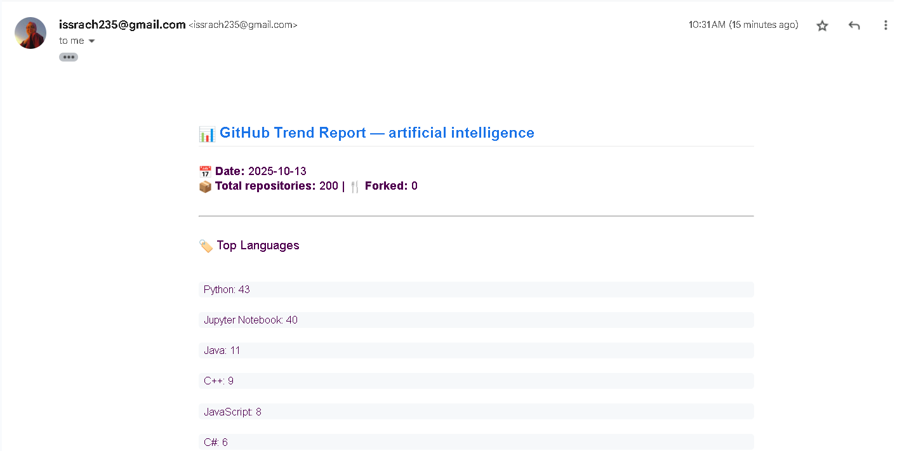
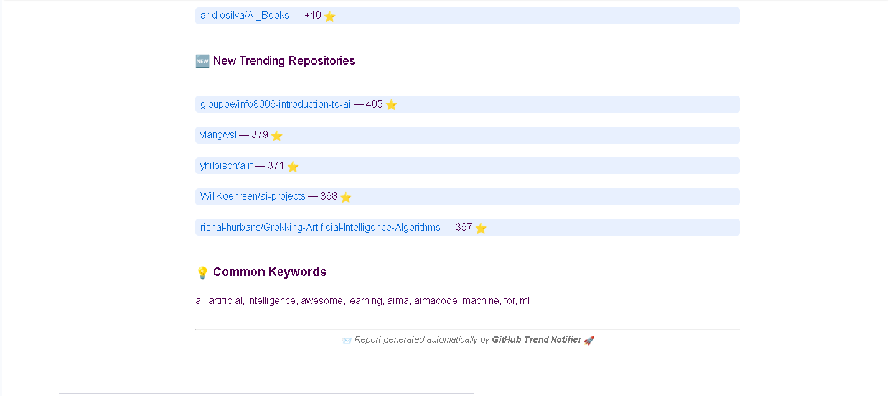

# 🤖 GitHub Trends Reporter

Automatically fetch, analyze, and email the latest GitHub trending repositories — every week.

---

## 🚀 Overview

**GitHub Trends Reporter** is a fully automated pipeline that:
- Fetches trending repositories from the **GitHub API**
- Analyzes top **languages**, **organizations**, and **topics**
- Generates structured JSON summaries
- Sends formatted **email reports** automatically
- Can be scheduled to run **weekly**

---
 
# 🤖 GitHub Trends Email Notifier

A fully automated pipeline that fetches trending GitHub repositories, analyzes trends, and emails a weekly summary — all powered by GitHub Actions.

---

## 🚀 Features
- 🔍 Fetches top trending repositories from the GitHub API  
- 📊 Analyzes top languages, organizations, and keywords  
- ✉️ Sends formatted weekly email summaries automatically  
- ⏰ Runs on a schedule via **GitHub Actions**

---

## ⚙️ How It Works
1. **Fetching:** Collects trending repositories using GitHub’s REST API  
2. **Processing:** Analyzes and summarizes repository statistics  
3. **Notifying:** Sends a clean HTML email report using SMTP  
4. **Automation:** Runs automatically every week via **GitHub Actions**

---

## 🧠 Project Architecture
Here’s an example of the automated weekly email summary generated by the pipeline:

<p align="center">
  
</p>

<p align="center">
  
</p>

> _These emails are automatically generated by the GitHub Actions workflow every week._

---

## 🗂️ File Structure
```bash
├── 📁 .git/ 🚫 (auto-hidden)
├── 📁 assets/
│   ├── 🖼️ email_summary_1.png
│   └── 🖼️ email_summary_2.png
├── 📁 data/
│   ├── 📁 outputs/
│   │   ├── 📄 .gitkeep
│   │   └── 📄 analysis_artificial_intelligence_2025-10-13.json
│   ├── 📁 raw/
│   │   ├── 📄 .gitkeep
│   │   └── 📄 github_trends_artificial_intelligence_2025_10_13.csv
│   └── 📄 .gitkeep
├── 📁 logs/
│   ├── 📄 .gitkeep
│   └── 📋 run_2025_10_13.log 🚫 (auto-hidden)
├── 📁 src/
│   ├── 📁 fetcher/
│   ├── 📁 notifier/
│   └── 📁 processor/
├── 📁 utils/
├── 🔒 .env 🚫 (auto-hidden)
├── 🚫 .gitignore
├── 📖 README.md
├── 🐍 config.py
├── 🐍 main.py
└── 📄 requirements.txt
```

---

## ▶️ Usage
1. Clone the repo  
```bash
git clone https://github.com/yourname/github-trends-notifier.git
```
2. Install dependencies
```bash
pip install -r requirements.txt
```
3. Create a .env file:
```bash
EMAIL_USER=youremail@gmail.com
EMAIL_PASS=yourapppassword
EMAIL_TO=otheremail@gmail.com
```
4. Run the main script to fetch trends, process data, and send email:

```bash
python main.py
```


