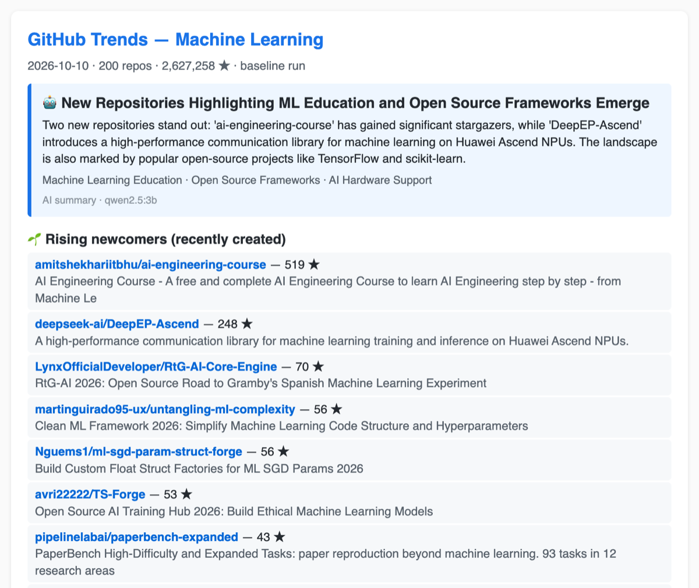
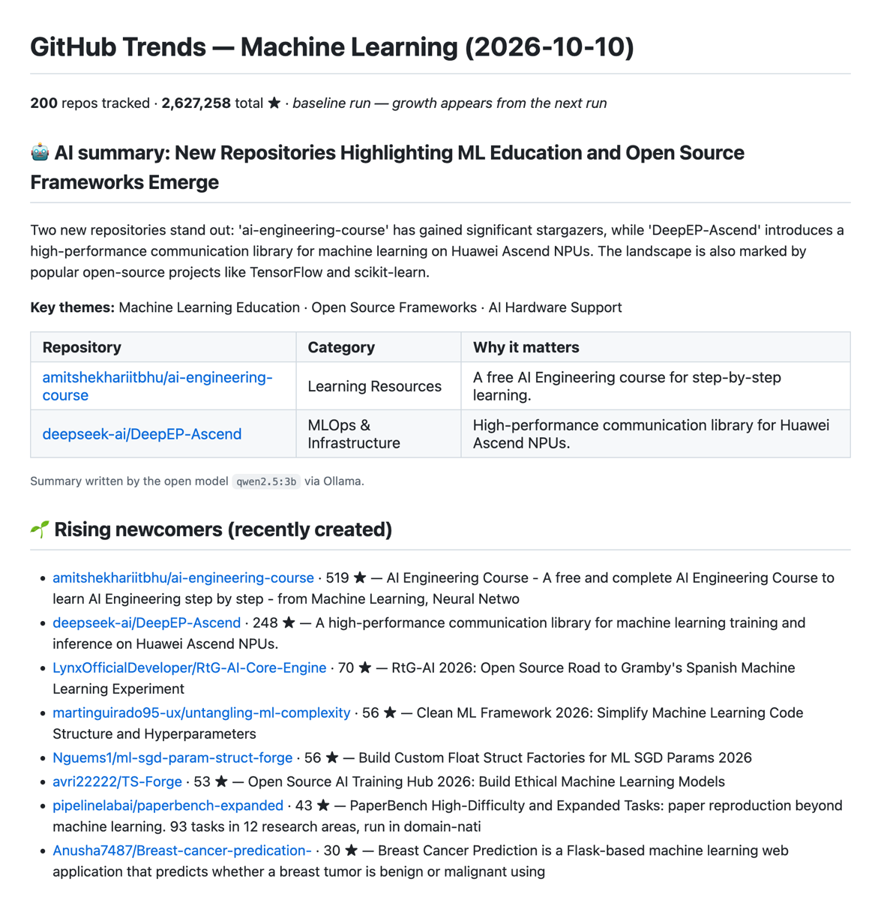
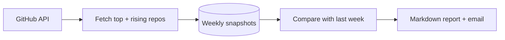

# 📈 GitHub Trends Reporter

[](https://github.com/Israaelhouch/github-trends-reporter/actions/workflows/ci.yml)
[](https://github.com/Israaelhouch/github-trends-reporter/actions/workflows/weekly-report.yml)


**A weekly report on what's growing in the ML ecosystem on GitHub.**

The pipeline tracks the top 200 repositories for a topic, measures their week-over-week star growth, spots newly
created repos that are taking off, and publishes the results as a Markdown report (and optionally by email).
It runs on GitHub Actions at no cost.

👉 **[Latest report](reports/LATEST.md)**

<p align="center">
  
</p>

<details>
<summary>📄 The same report as Markdown in the repo (click to expand)</summary>
<p align="center"></p>
</details>

## How it works


```mermaid
flowchart LR
    A[GitHub API] --> B[Fetch top + rising repos]
    B --> C[(Weekly snapshots)]
    C --> D[Compare with last week]
    D --> E[Markdown report + email]
```

1. **Fetch** the all-time top repos and the most-starred repos created in the last 30 days.
2. **Snapshot** each repo's star count. A run adds an ~8 KB CSV, committed to the repo.
3. **Compare** with last week's snapshot: fastest growing repos, new entries, languages, topics.
4. **Deliver** the report to `reports/` (committed automatically) and, if configured, by email.

**Optional summary:** if [Ollama](https://ollama.com) is available, a small open model (`qwen2.5:3b`) adds a short
written overview at the top of the report. Its output is schema-validated and checked against the data before use;
if it's unavailable, the report is produced without it.

## Quick start

```bash
git clone https://github.com/Israaelhouch/github-trends-reporter.git
cd github-trends-reporter
make install

# Optional written summary: install Ollama from https://ollama.com, then
ollama serve &
make ai-setup        # downloads qwen2.5:3b (~2 GB)

make run             # report → reports/LATEST.md
```

Other topics: `python main.py --topic "large language models" --no-email`.
Skip the summary with `--no-ai`.

## Running it on GitHub Actions

It works out of the box. The weekly workflow (Mondays, 08:00 UTC) starts Ollama as a service container,
runs the pipeline, and commits the report. Run it manually from **Actions → Weekly GitHub Trends Report → Run workflow**.

Optional settings, under **Settings → Secrets and variables → Actions**:

| Name | Type | Purpose |
|---|---|---|
| `EMAIL_USER`, `EMAIL_PASS`, `EMAIL_TO` | Secrets | Send the report by email (Gmail needs an [App Password](https://support.google.com/accounts/answer/185833)) |
| `TOPIC` | Variable | Topic to track (default: `machine learning`) |
| `AI_MODEL` | Variable | Ollama model for the summary (default `qwen2.5:3b`) |
| `DATABASE_URL` | Secret | Store history in PostgreSQL instead of CSV files |

For local runs, the same settings go in `.env` (see [`.env.example`](.env.example)).

## Project layout

```
main.py              pipeline entry point
src/fetcher/         GitHub API client: pagination, retries, rate limits
src/db/history.py    weekly snapshots (CSV or SQL)
src/processor/       growth analysis
src/ai/insights.py   optional summary (Ollama)
src/notifier/        email / Markdown templates
tests/               36 tests, no network needed
```

**Stack:** Python · pandas · SQLAlchemy · Pydantic · Ollama · GitHub Actions · Docker · pytest · ruff

```bash
make test   # run tests
make lint   # lint + format check
```

---

**Israa Elhouch** · [GitHub](https://github.com/Israaelhouch) · israa.elhouch.dev@gmail.com
